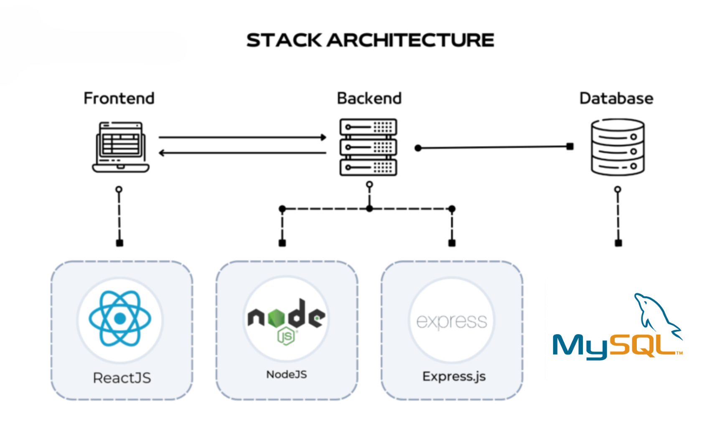
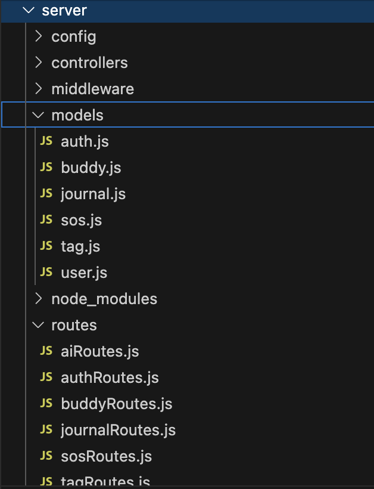
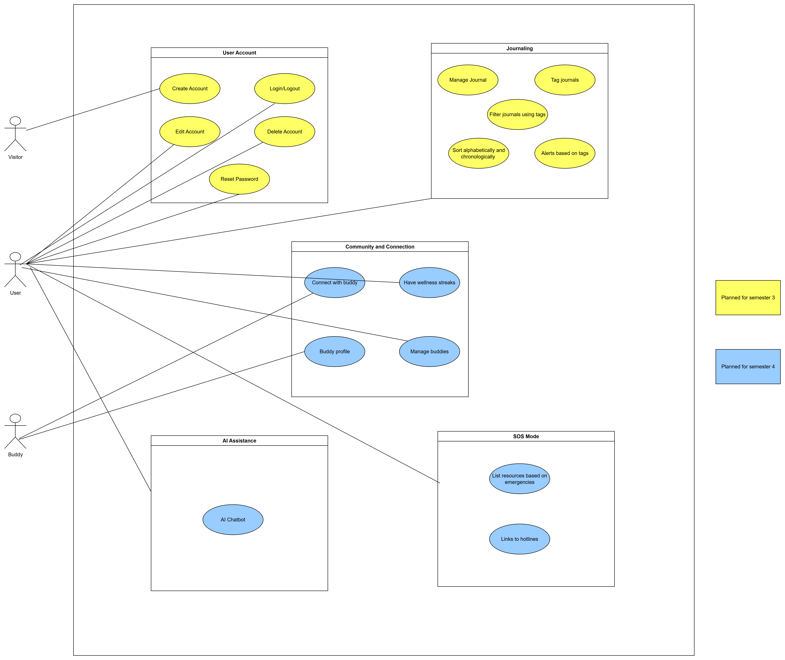
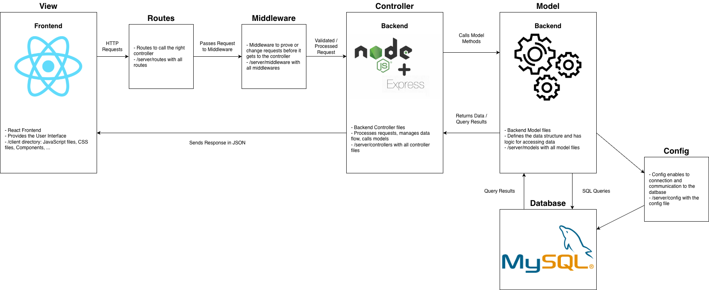
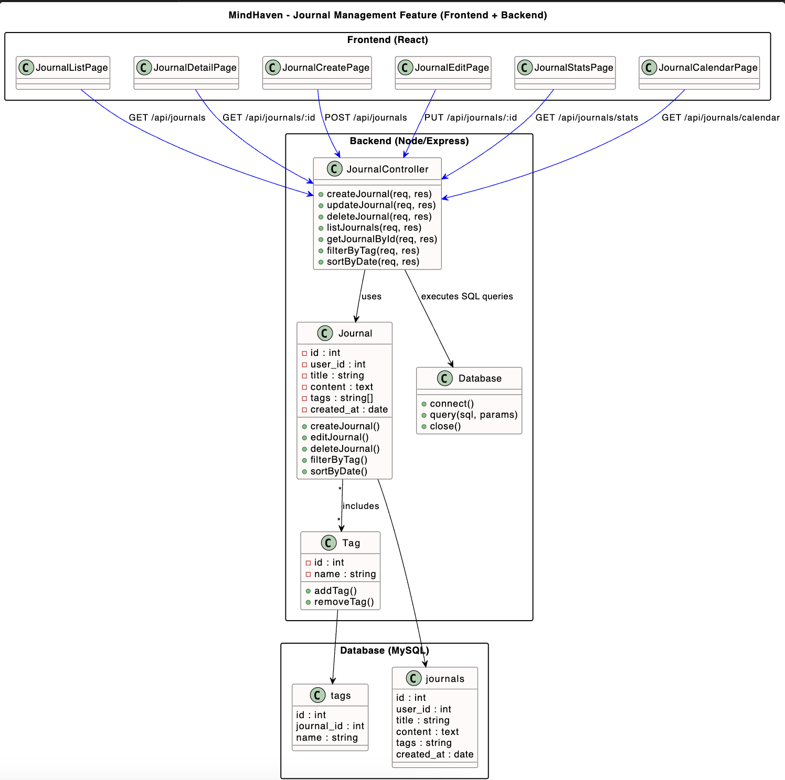
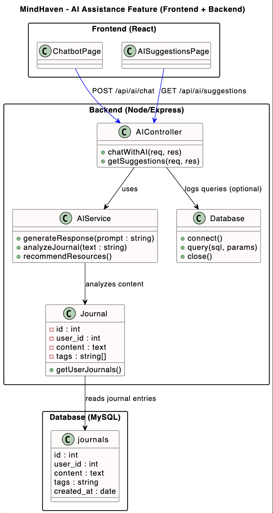

# Software Architecture Document

# Table of Contents
- [Introduction](#1-introduction)
    - [Purpose](#11-purpose)
    - [Scope](#12-scope)
    - [Definitions, Acronyms and Abbreviations](#13-definitions-acronyms-and-abbreviations)
    - [References](#14-references)
    - [Overview](#15-overview)
- [Architectural Representation](#2-architectural-representation)
- [Architectural Goals and Constraints](#3-architectural-goals-and-constraints)
- [Use-Case View](#4-use-case-view)
- [Logical View](#5-logical-view)
    - [Overview](#51-overview)
    - [Architecturally Significant Design Packages]
    - [5.4 Implemented features and components]
    (#52-architecturally-significant-design-packages)
    - [Refactoring with Design Patterns](#53-refactoring-with-design-patterns)
- [Process View](#6-process-view)
- [Deployment View](#7-deployment-view)
- [Implementation View](#8-implementation-view)
- [Data View](#9-data-view)
- [Size and Performance](#10-size-and-performance)
- [Quality](#11-quality)

## 1. Introduction

### 1.1 Purpose
This document provides a comprehensive architectural overview of the system, using a number of different architectural views to depict different aspects of the system. It is intended to capture and convey the significant architectural decisions which have been made on the system.

### 1.2 Scope
This document describes the technical architecture of the Mindhaven project, including the structure of classes, modules and dependencies.

### 1.3 Definitions, Acronyms and Abbreviations

| Abbrevation | Description                            |
| ----------- | -------------------------------------- |
| API         | Application programming interface      |
| MVC         | Model View Controller                  |
| REST        | Representational state transfer        |
| SDK         | Software development kit               |
| SRS         | Software Requirements Specification    |
| UC          | Use Case                               |
| VCS         | Version Control System                 |
| n/a         | not applicable                         |

### 1.4 References

| Title                                                              | Date       | Publishing organization   |
| -------------------------------------------------------------------|:----------:| ------------------------- |
| [Mindhaven Blog](https://mindhavenapp-kunpy.wordpress.com/mindhaven/)| 05.11.2025 |Mindhaven  |
| [GitHub Repository](https://github.com/dav-lehmann-24/Mindhaven)| 05.11.2025 |Mindhaven  |
| [Overall Use Case Diagram](Pictures/UCD.png)| 05.11.2025 |Mindhaven  |
| [SRS](SRS.md)| 05.11.20254 |Mindhaven  |
| [UC:Create Account](UCCreateAccount.md)| 05.11.2025 |Mindhaven  |
| [UC:Edit Account](UCEditAccount.md)| 05.11.2025 |Mindhaven  |
| [UC:Delete Account](UCDeleteAccount.md)| 05.11.2025 |Mindhaven  |
| [UC:Log in and Log out](UCLogin_logout.md)|05.11.2025 |Mindhaven  |
| [UC:Manage Journals](UCManagePost.md)| 05.11.2025 |Mindhaven  |
| [UC:Reset Password](UCResetPassword.md)|05.11.2025 |Mindhaven  |
| [UC:Show Alerts](UCManageAlerts.md)|05.11.2025 |Mindhaven  |
| [UC:Tag Journals](UCManageAlerts.md)|05.11.2025 |Mindhaven  |
| [UC:Filter Journals using tags](UCManageAlerts.md)|05.11.2025 |
| [UC:Sort Journals](UCManageAlerts.md)|05.11.2025 |

### 1.5 Overview
This document contains the Architectural Representation, Goals and Constraints as well
as the Logical, Deployment, Implementation and Data Views.

## 2. Architectural Representation
The back-end server uses Node.js + Express for REST APIs, front-end side is a React.js client with React Router and Axios. We follow the Model-View-Control.

  

In the backend we have folders for our 'model' and 'controller' files.

  

In our frontend we manage the 'view' with components implemented on pages.

  

## 3. Architectural Goals and Constraints
As mentioned in the second chapter, frontend and backend are using MVC pattern. This enables a clean software architecture with separate view, controller and model. 

### Front-end
React serves as the front-end framework. It manages the UI and consumes data via API calls

### Back-end
Node.js and Express provides the back-end framework, offering RESTful endpoints for the front-end to use.

The front-end and back-end are spearate but communicate via a REST API.
They are both written in Javascript. 

### Goals

Secure authentication

Clean modular architecture

Reusable controllers & models

Separation of concerns

Scalable REST API

Token-based authentication

### Constraints

JavaScript-based stack (React + Node.js)

MySQL relational schema

Multer file upload restrictions

Environment variable security for email + JWT

## 4. Use-Case View
Our overall UC diagram:

  

## 5. Logical View

### 5.1 Overview
The our project our elements are categorized by model, view and controller.

  

1. User Interaction (view)
    A user interaction will trigger a function to handle the form submission.
2. Request Handling (Controller)
    The Controller receives the request, validates the data and passes it to the model.
3. Database Interaction (Model)
    Model interacts with our database and performes operations.
4. Response (Controller & View) 
    The Controller sends back the result (success or error), which is then handled by the view to update the user interface accordingly.

Generating an Architectural UML diagram for a JavaScript (JS) application are challenging because most UML tools and generators are geared toward object-oriented languages (like Java or C#) with strict class-based structures.
We've tried PlantUML and UML Generator in VSC but it does not automatically generate UML Diagrams, but we have to code Diagrams ourselfs.

#### Backend Data Flow

User sends request → Frontend (React)

Controller receives it → Express route → Controller

Controller calls Model → DB Query

Model returns result → Controller formats response

Response returned to Frontend

[You can see our components here.]()

This is the class diagram for the feature Authentication

  

This is the class diagram for the feature Journal

  

This is the class diagram for the feature AI assistance

  

This is the class diagram for the feature SoS Mode

  

This is the class diagram for the feature Buddy

  

### 5.2 Architecturally Significant Design Packages
- Multer (File Upload Middleware)
- JWT Authentication (Used in middleware to validate access.)
- Axios (HTTP Client)
- Nodemailer (Used for password reset link delivery.)

These can be considered architectually significant.

---

### 5.3 Refactoring with Design Patterns

In addition to the MVC structure, we have refactored parts of our backend using well-established **Design Patterns** to enhance scalability, maintainability, and modularity.

#### Singleton Pattern – JWT Authentication Service
We applied the **Singleton Pattern** in our **JWT Authentication** logic.  
The `jwtService.js` file is implemented as a **single shared instance** that provides consistent methods for token creation, verification, and decoding throughout the application.

This ensures:
- A single source of truth for the secret key and expiry configuration  
- Reduced redundancy by reusing the same JWT utility instance  
- Improved security and easier maintenance of authentication logic  

### 5.4 Implemented features and components

✔ Authentication

authController.js

auth.js (model)

authRoutes.js

JWT-based login

Password reset via token + email

✔ User Profile

Get profile

Update profile

Upload profile picture (multer)

Delete user account

✔ Journal Management

journal.js

Create / update / delete

Fetch all journals for authenticated user

## 6. Process View

### Login Sequence
        
React Login Page
        ↓
POST /api/auth/login
        ↓
authController.loginUser()
        ↓
Compare password (bcrypt)
        ↓
Generate JWT (jsonwebtoken)
        ↓
Return token to client
     
### Password Reset Flow

User requests password reset
        ↓
Backend generates token
        ↓
Saves token in DB
        ↓
Sends email with reset link
        ↓
User submits new password
        ↓
Backend verifies token → updates password

###Journal CURD

All journal routes require verifyToken

Operations are tied to req.user.id

## 7. Deployment View

Our Deployment setup includes a client and a server. 
┌──────────────────────────────────┐
│     React Frontend (Client)      │
│  - Pages                         │
│  - Components                    │
│  - Axios API calls               │
└─────────────────┬────────────────┘
                  │
                  ▼
┌──────────────────────────────────┐
│  Node.js + Express Backend       │
│  - Controllers / Models          │
│  - Middleware                    │
│  - Upload server                 │
│  - Email service                 │
└─────────────────┬────────────────┘
                  │
                  ▼
┌──────────────────────────────────┐
│           MySQL Database         │
│  - users                         │
│  - journals                      │
│  - password_reset_tokens         │
└──────────────────────────────────┘

## 9. Data View
Our database structure in a schema:

  

## 10. Size and Performance
n/a

## 11. Quality/Metrics

n/a
