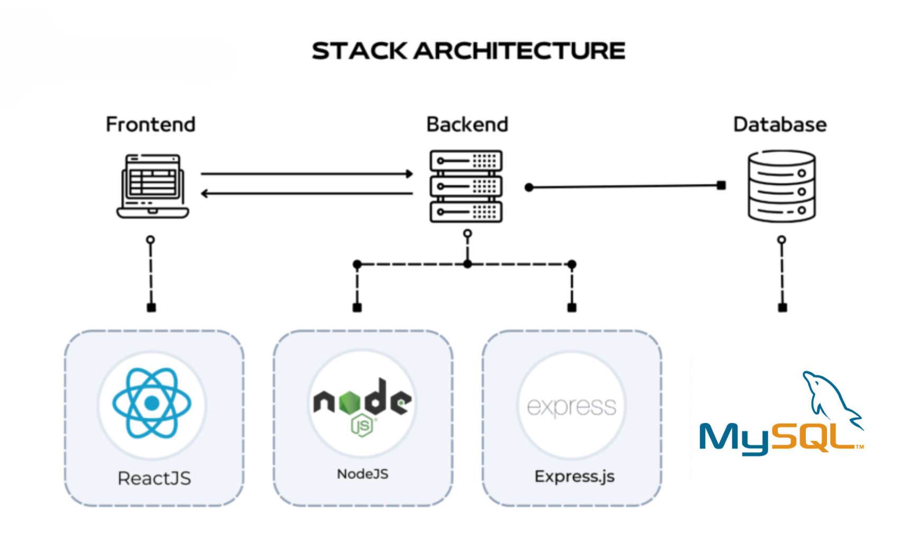
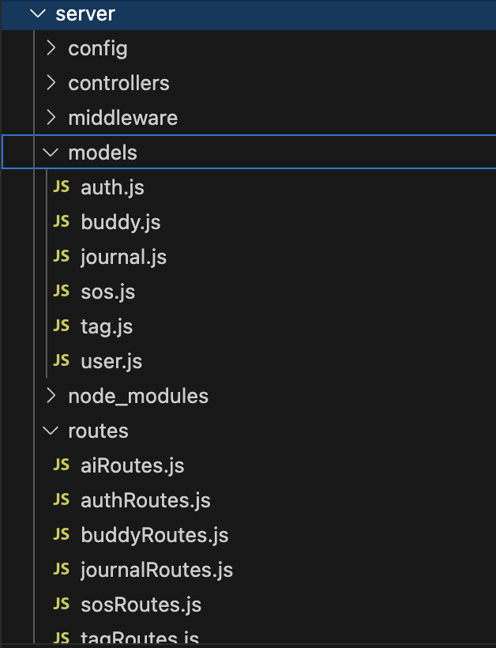
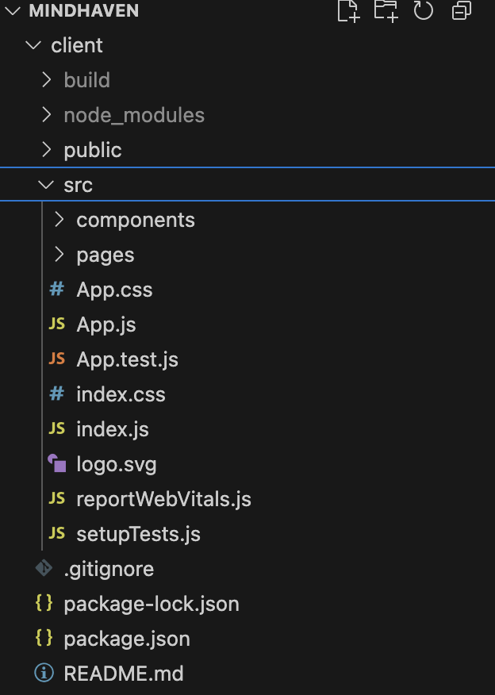
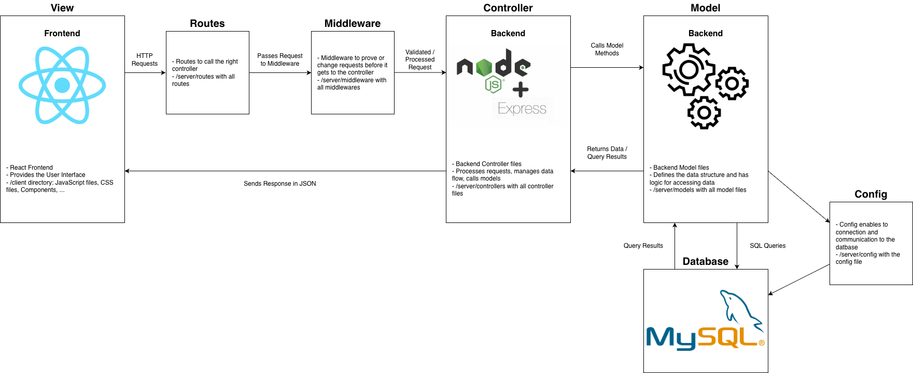
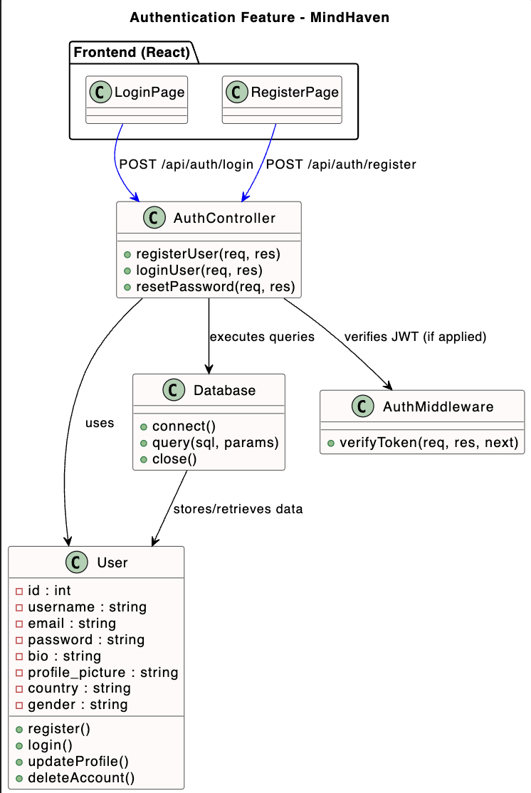
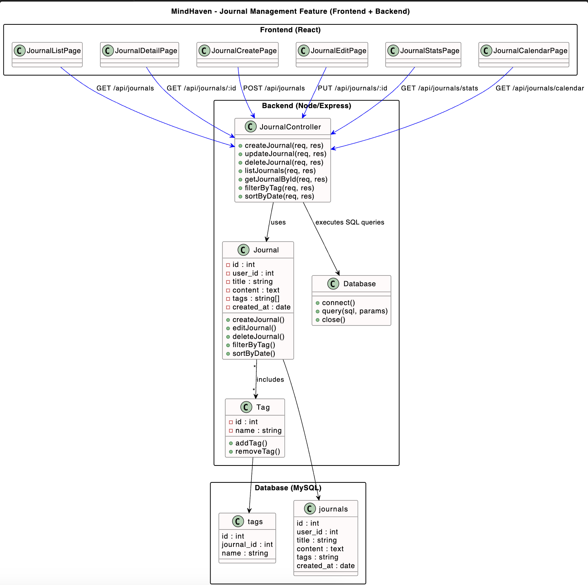
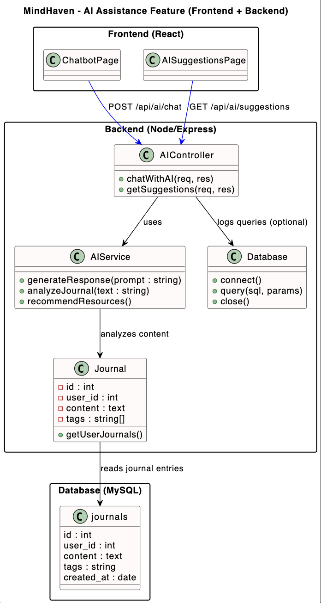
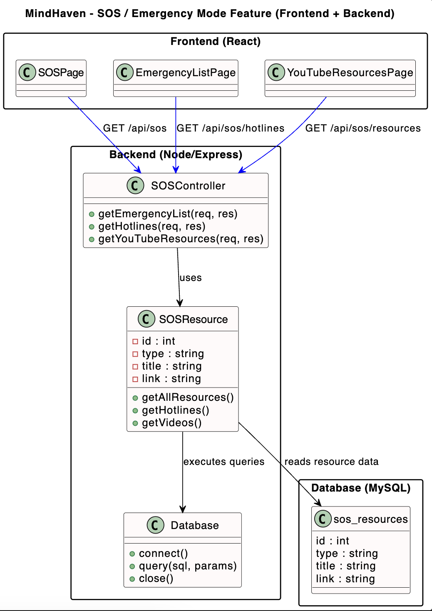
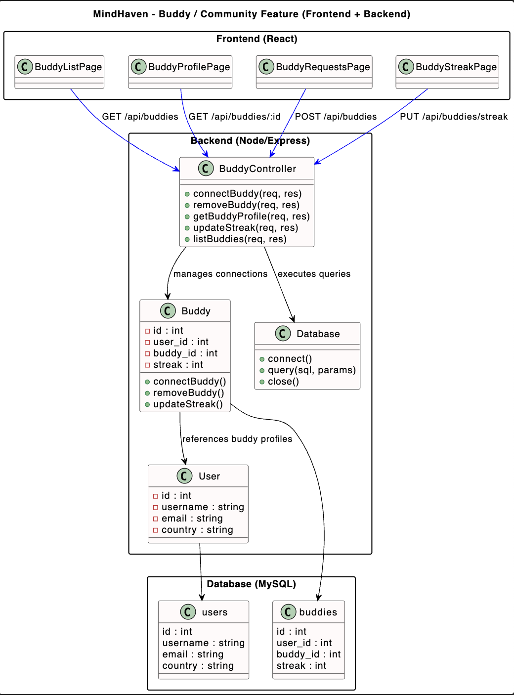
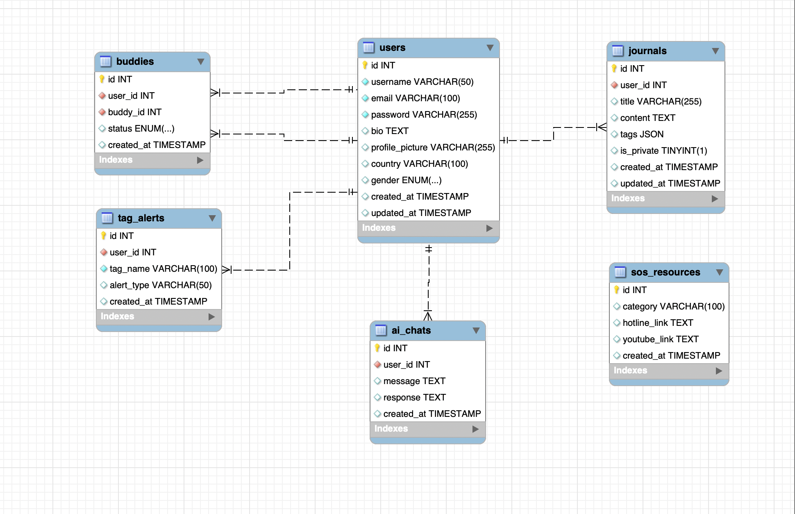

# Software Architecture Document

# Table of Contents
- [Introduction](#1-introduction)
    - [Purpose](#11-purpose)
    - [Scope](#12-scope)
    - [Definitions, Acronyms and Abbreviations](#13-definitions-acronyms-and-abbreviations)
    - [References](#14-references)
    - [Overview](#15-overview)
- [Architectural Representation](#2-architectural-representation)
- [Architectural Goals and Constraints](#3-architectural-goals-and-constraints)
- [Use-Case View](#4-use-case-view)
- [Logical View](#5-logical-view)
    - [Overview](#51-overview)
    - [Architecturally Significant Design Packages](#52-architecturally-significant-design-packages)
    - [Refactoring with Design Patterns](#53-refactoring-with-design-patterns)
    - [Implemented features and components](#54-implemented-features-and-components)
- [Process View](#6-process-view)
- [Deployment View](#7-deployment-view)
- [Implementation View](#8-implementation-view)
- [Data View](#9-data-view)
- [Size and Performance](#10-size-and-performance)
- [Quality/Metrics](#11-qualitymetrics)


## 1. Introduction

### 1.1 Purpose
This document provides a comprehensive architectural overview of the system, using a number of different architectural views to depict different aspects of the system. It is intended to capture and convey the significant architectural decisions which have been made on the system.

### 1.2 Scope
This document describes the technical architecture of the Mindhaven project, including the structure of classes, modules and dependencies.

### 1.3 Definitions, Acronyms and Abbreviations

| Abbrevation | Description                            |
| ----------- | -------------------------------------- |
| API         | Application programming interface      |
| MVC         | Model View Controller                  |
| REST        | Representational state transfer        |
| SDK         | Software development kit               |
| SRS         | Software Requirements Specification    |
| UC          | Use Case                               |
| VCS         | Version Control System                 |
| n/a         | not applicable                         |

### 1.4 References

| Title                                                              | Date       | Publishing organization   |
| -------------------------------------------------------------------|:----------:| ------------------------- |
| [Mindhaven Blog](https://mindhavenapp-kunpy.wordpress.com/mindhaven/)| 05.11.2025 |Mindhaven  |
| [GitHub Repository](https://github.com/dav-lehmann-24/Mindhaven)| 05.11.2025 |Mindhaven  |
| [Overall Use Case Diagram](Pictures/UCD.png)| 05.11.2025 |Mindhaven  |
| [SRS](SRS.md)| 05.11.2025 |Mindhaven  |
| [UC:Create Account](UCCreateAccount.md)| 05.11.2025 |Mindhaven  |
| [UC:Edit Account](UCEditAccount.md)| 05.11.2025 |Mindhaven  |
| [UC:Delete Account](UCDeleteAccount.md)| 05.11.2025 |Mindhaven  |
| [UC:Log in and Log out](UCLoginLogout.md)|05.11.2025 |Mindhaven  |
| [UC:Manage Journals](UCManageJournal.md)| 05.11.2025 |Mindhaven  |
| [UC:Reset Password](UCResetPassword.md)|05.11.2025 |Mindhaven  |
| [UC:Show Alerts](UCAlerts.md)|05.11.2025 |Mindhaven  |
| [UC:Tag Journals](UCAddTags.md)|05.11.2025 |Mindhaven  |
| [UC:Filter Journals using tags](UCTagSearch.md)|05.11.2025 |Mindhaven |
| [UC:Sort Journals](UCSort.md)|05.11.2025 |Mindhaven |
| [UC: AI Assistance]()|12.05.2026 |Mindhaven |
| [UC: Buddy ]()|25.04.2026 |Mindhaven |
| [UC: SOS Mode]()|13.05.2026 |Mindhaven |


### 1.5 Overview
This document contains the Architectural Representation, Goals and Constraints as well
as the Logical, Deployment, Implementation and Data Views.

## 2. Architectural Representation
The back-end server uses Node.js + Express for REST APIs, front-end side is a React.js client with React Router and Axios. We follow the Model-View-Control.

 <br>

In the backend we have folders for our 'model' and 'controller' files.

 <br>

In our frontend we manage the 'view' with components implemented on pages.

 <br>


## 3. Architectural Goals and Constraints
As mentioned in the second chapter, frontend and backend are using MVC pattern. This enables a clean software architecture with separate view, controller and model. 

### Front-end
React serves as the front-end framework. It manages the UI and consumes data via API calls

### Back-end
Node.js and Express provides the back-end framework, offering RESTful endpoints for the front-end to use.

The front-end and back-end are spearate but communicate via a REST API.
They are both written in Javascript. 

### Goals

Secure authentication

Clean modular architecture

Reusable controllers & models

Separation of concerns

Scalable REST API

Token-based authentication

### Constraints

JavaScript-based stack (React + Node.js)

MySQL relational schema

Multer file upload restrictions

Environment variable security for email + JWT

## 4. Use-Case View
Our overall UC diagram:

 <br>


## 5. Logical View


### 5.1 Overview
The our project our elements are categorized by model, view and controller.


 <br>

1. User Interaction (view)
    A user interaction will trigger a function to handle the form submission.
2. Request Handling (Controller)
    The Controller receives the request, validates the data and passes it to the model.
3. Database Interaction (Model)
    Model interacts with our database and performes operations.
4. Response (Controller & View) 
    The Controller sends back the result (success or error), which is then handled by the view to update the user interface accordingly.

Generating an Architectural UML diagram for a JavaScript (JS) application are challenging because most UML tools and generators are geared toward object-oriented languages (like Java or C#) with strict class-based structures.
We've tried PlantUML and UML Generator in VSC but it does not automatically generate UML Diagrams, but we have to code Diagrams ourselfs.

[You can see our components here.](client/src/components)

This is the class diagram for the feature Authentication

 <br>

This is the class diagram for the feature Journal

 <br>

This is the class diagram for the feature AI assistance

 <br>

This is the class diagram for the feature SoS Mode

 <br>

This is the class diagram for the feature Buddy

 <br>


### 5.2 Architecturally Significant Design Packages
- Multer (File Upload Middleware)
- JWT Authentication (Used in middleware to validate access.)
- Axios (HTTP Client)
- Nodemailer (Used for password reset link delivery.)

These can be considered architectually significant.

---

### 5.3 Refactoring with Design Patterns

In addition to the MVC structure, we have refactored parts of our backend using well-established **Design Patterns** to enhance scalability, maintainability, and modularity.

#### Observer Pattern - Buddy Checklist Streaks
We applied the **Observer Pattern** to the Buddy checklist feature.
The controller records checklist task changes, then notifies a checklist subject. The subscribed streak observer decides whether both buddies completed all shared tasks for the day and whether a streak should be awarded.

This ensures:
- Checklist task updates and streak-awarding logic are separated
- More observers can be added without changing the checklist controller
- Buddy streak updates remain consistent for both users in the buddy pair

Relevant files:
- `server/observers/BuddyChecklistSubject.js`
- `server/observers/BuddyStreakObserver.js`
- `server/observers/buddyChecklistNotifier.js`
- `server/controllers/buddyController.js`

### 5.4 Implemented features and components

✔ Authentication

authController.js

auth.js (model)

authRoutes.js

JWT-based login

Password reset via token + email

✔ User Profile

Get profile

Update profile

Upload profile picture (multer)

Delete user account

✔ Journal Management

journal.js

Create / update / delete

Fetch all journals for authenticated user

✔ Tags and Mood Alerts

tagController.js

tag.js (model)

tagRoutes.js

Fetch tags by mood category

Analyze recent journal tags and return mood trend alerts

✔ Buddy System

buddyController.js

buddy.js (model)

buddyRoutes.js

Send, accept, reject, list and remove buddy connections

Shared buddy checklist tasks

Automatic streak updates through the Observer Pattern

✔ AI Mental Health Support

aiController.js

aiRoutes.js

localMentalHealthAiService.js

mental_health_ai.py

Authenticated `POST /api/ai/support` endpoint

Local Hugging Face Transformers model for supportive mental health replies

Safety disclaimer and crisis guidance returned with each AI response

✔ SOS Mode

SOSPage.js

SOSPage.module.css

AppHeader.js navigation to `/sos`

Frontend emergency support page with emergency type selection, focused guidance, hotlines and resource sections

The backend SOS files currently exist as placeholders for future API/database integration.

## 6. Process View

### Login Sequence
        
React Login Page
        ↓
POST /api/auth/login
        ↓
authController.loginUser()
        ↓
Compare password (bcrypt)
        ↓
Generate JWT (jsonwebtoken)
        ↓
Return token to client
     
### Password Reset Flow

User requests password reset
        ↓
Backend generates token
        ↓
Saves token in DB
        ↓
Sends email with reset link
        ↓
User submits new password
        ↓
Backend verifies token → updates password

### Journal CRUD

All journal routes require verifyToken

Operations are tied to req.user.id

### Buddy Checklist and Streak Flow

Authenticated user toggles buddy checklist task
        ↓
buddyController validates accepted buddy connection
        ↓
Buddy model stores or removes today's completion
        ↓
buddyChecklistNotifier notifies BuddyChecklistSubject
        ↓
BuddyStreakObserver checks whether both buddies completed all tasks today
        ↓
If eligible, streak is incremented for both buddy records
        ↓
Updated checklist and streakAwarded result are returned to the client

### AI Support Flow

Authenticated user sends support message
        ↓
POST /api/ai/support
        ↓
aiController validates message input
        ↓
localMentalHealthAiService starts server/python/mental_health_ai.py
        ↓
Python script loads local Transformers model and generates a supportive reply
        ↓
Controller returns reply, disclaimer and crisis guidance


## 7. Deployment View

Our Deployment setup includes a client and a server. 

```text
┌──────────────────────────────────┐
│     React Frontend (Client)      │
│  - Pages                         │
│  - Components                    │
│  - Axios API calls               │
└─────────────────┬────────────────┘
                  │
                  ▼
┌──────────────────────────────────┐
│  Node.js + Express Backend       │
│  - Controllers / Models          │
│  - Middleware                    │
│  - Upload server                 │
│  - Email service                 │
│  - Local AI service bridge       │
└─────────────────┬────────────────┘
                  │
                  ▼
┌──────────────────────────────────┐
│           MySQL Database         │
│  - users                         │
│  - journals                      │
│  - password_reset_tokens         │
│  - buddies                       │
│  - buddy_tasks                   │
│  - buddy_task_completions        │
└──────────────────────────────────┘
```


The backend also depends on a Python runtime for local AI inference. Python dependencies are listed in `server/python/requirements.txt` and include `transformers`, `torch`, and `sentencepiece`.

Important environment variables include:
- Database connection settings
- JWT secret
- Email service credentials
- `LOCAL_AI_MODEL`, `LOCAL_AI_PYTHON`, and `LOCAL_AI_TIMEOUT_MS` for the local AI service


## 8. Implementation View

The implementation is organized by client and server responsibilities.

### Client
- `client/src/pages`: page-level React views such as login, registration, dashboard, journal creation and journal list.
- `client/src/components`: reusable UI components such as buttons, cards, forms, headers, footers, alerts and journal entry cards.
- `client/src/App.js`: React Router configuration and top-level layout.
- `client/src/pages/SOSPage.js`: frontend SOS mode view for emergency guidance and resources.

### Server
- `server/index.js`: Express application setup, middleware and route registration.
- `server/routes`: API route definitions for auth, users, journals, tags, buddies, AI, tests and planned SOS backend integration.
- `server/controllers`: request validation, response formatting and coordination between routes and models.
- `server/models`: MySQL query logic for users, auth, journals, tags, buddies and planned SOS backend integration.
- `server/middleware`: JWT authentication and upload middleware.
- `server/utils`: email reset service.
- `server/services`: local AI bridge used by the AI controller.
- `server/observers`: Buddy checklist subject and streak observer.
- `server/python`: local AI inference script and Python dependency list.

### Main API Areas
- Authentication: `/api/auth`
- User profile: `/api/user`
- Journals: `/api/journal`
- Tags and mood trends: `/api/tags`
- Buddies and buddy checklist: `/api/buddies`
- AI support: `/api/ai/support`


## 9. Data View
Our database structure in a schema:

 <br>

Architecturally significant data entities include:
- `users`: account profile, login identity and profile data
- `journals`: user-owned journal entries and journal tags
- `password_resets` or password reset token storage: password reset flow
- `buddies`: buddy relationships, request status and streak data
- `buddy_tasks`: shared tasks for an accepted buddy pair
- `buddy_task_completions`: per-user daily completion records for buddy tasks

Controllers enforce user ownership by using the authenticated `req.user.id`, especially for journals, profile data, buddy connections and mood trend analysis.

## 10. Size and Performance
- The React client and Express server are separated, allowing client and API changes to be maintained independently.
- Journal, tag and buddy operations are database-backed and scoped by authenticated user id.
- AI response generation is the highest-latency feature because it starts local Python inference and loads a Transformers model. The service has a configurable timeout through `LOCAL_AI_TIMEOUT_MS`.
- File uploads are handled by Multer and served through the backend upload directory.
- For a production environment, local AI model loading should be monitored for memory usage and startup latency.

## 11. Quality/Metrics

Quality is supported through:
- JWT-protected routes for private user, journal, buddy, AI and mood trend endpoints
- Password hashing with bcrypt for authentication
- Environment variables for secrets such as email credentials and JWT configuration
- Input validation in controllers before database operations
- User ownership checks through `req.user.id`
- Unit and integration tests using Jest and Supertest
- Coverage reports generated under `server/coverage`
- Observer Pattern separation for buddy streak logic, reducing controller complexity

Remaining quality risks:
- SOS is implemented on the frontend, but backend SOS API/database integration is still planned.
- AI support is not a replacement for professional care, so responses include a disclaimer and crisis guidance.
- The local AI model may be slow or unavailable if Python dependencies are missing.
