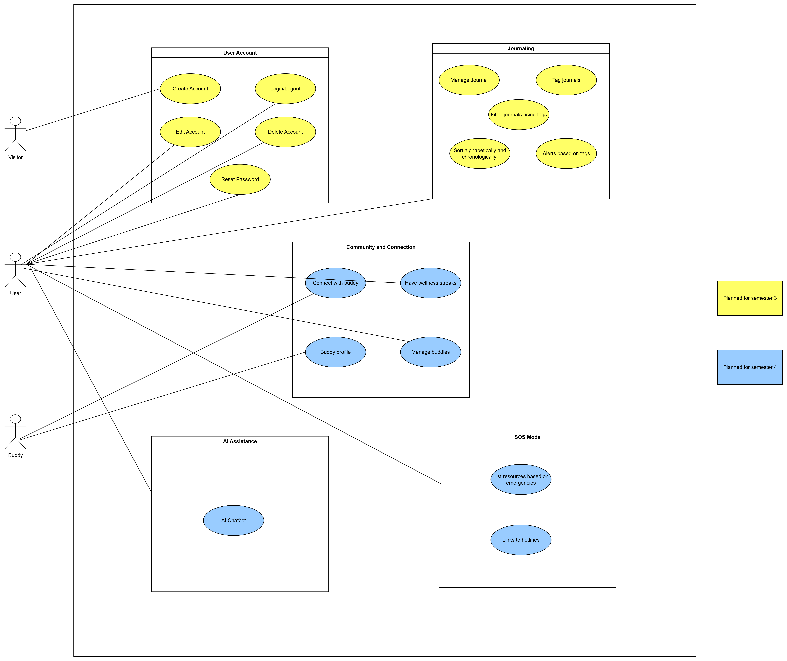

# Mindhaven - Software Requirements Specification 

## Table of contents
- [Table of contents](#table-of-contents)
- [Introduction](#1-introduction)
    - [Purpose](#11-purpose)
    - [Scope](#12-scope)
    - [Definitions, Acronyms and Abbreviations](#13-definitions-acronyms-and-abbreviations)
    - [References](#14-references)
    - [Overview](#15-overview)
- [Overall Description](#2-overall-description)
    - [Vision](#21-vision)
    - [Use Case Diagram](#22-use-case-diagram)
	- [Technology Stack](#23-technology-stack)
- [Specific Requirements](#3-specific-requirements)
    - [Functionality](#31-functionality)
    - [Usability](#32-usability)
    - [Reliability](#33-reliability)
    - [Performance](#34-performance)
    - [Supportability](#35-supportability)
    - [Design Constraints](#36-design-constraints)
    - [Online User Documentation and Help System Requirements](#37-on-line-user-documentation-and-help-system-requirements)
    - [Purchased Components](#purchased-components)
    - [Interfaces](#39-interfaces)
    - [Licensing Requirements](#310-licensing-requirements)
    - [Legal, Copyright And Other Notices](#311-legal-copyright-and-other-notices)
    - [Applicable Standards](#312-applicable-standards)
- [Supporting Information](#4-supporting-information)

## 1. Introduction

### 1.1 Purpose
This Software Requirements Specification (SRS) describes all specifications for the application "Mindhaven". It includes an overview about this project and its vision, detailed information about the planned features and boundary conditions of the development process.

### 1.2 Scope
The project is going to be realized as a web application.  
  
Actors of this application are users.

Current and planned subsystems include:

- Authentication

- Account management

- Journal management

- AI assistance

- SOS Mode

- Buddy Circle

- Tag-based mood alerts

### 1.3 Definitions, Acronyms and Abbreviations
| Abbrevation | Explanation                            |
| ----------- | -------------------------------------- |
| SRS         | Software Requirements Specification    |
| UC          | Use Case                               |
| AI          | Artificial Intelligence                |
| API         | Application Programming Interface      |
| JWT         | JSON Web Token                         |
| REST        | Representational State Transfer        |
| N/A         | Not Applicable                         |
| TBD         | To Be Determined                       |
| OUCD        | Overall Use Case Diagram               |
| FAQ         | Frequently asked Questions             |

### 1.4 References

| Title                                                                   | Date       | Publishing organization   |
| ----------------------------------------------------------------------- |:----------:| ------------------------- |
| [Mindhaven Blog](https://mindhavenapp-kunpy.wordpress.com/mindhaven)    | 05.11.2025 | Mindhaven Team    		   |
| [GitHub](https://github.com/dav-lehmann-24/Mindhaven)                   | 05.11.2025 | Mindhaven Team    		   |
| [Software Architecture Document](SAD.md)                                | 05.11.2025 | Mindhaven Team            |
| [Test Plan](Test_Plan.md)                                               | 05.11.2025 | Mindhaven Team            |
| [Overall Use Case Diagram](Pictures/UCD.png)                            | 05.11.2025 | Mindhaven Team            |
| [UC: Create Account](UCCreateAccount.md)                                | 05.11.2025 | Mindhaven Team            |
| [UC: Edit Account](UCEditAccount.md)                                    | 05.11.2025 | Mindhaven Team            |
| [UC: Delete Account](UCDeleteAccount.md)                                | 05.11.2025 | Mindhaven Team            |
| [UC: Log in and Log out](UCLoginLogout.md)                              | 05.11.2025 | Mindhaven Team            |
| [UC: Manage Journals](UCManageJournal.md)                               | 05.11.2025 | Mindhaven Team            |
| [UC: Reset Password](UCResetPassword.md)                                 | 05.11.2025 | Mindhaven Team            |
| [UC: Add Tags](UCAddTags.md)                                            | 05.11.2025 | Mindhaven Team            |
| [UC: Alerts](UCAlerts.md)                                               | 05.11.2025 | Mindhaven Team            |
| [UC: Tag Search](UCTagSearch.md)                                        | 05.11.2025 | Mindhaven Team            |
| [UC: Sort Journals](UCSort.md)                                          | 05.11.2025 | Mindhaven Team            |

### 1.5 Overview
The following chapter provides an overview of this project with vision and Overall Use Case Diagram. The third chapter (Requirements Specification) delivers more details about the specific requirements in terms of functionality, usability and design parameters. Finally there is a chapter with supporting information. 
    
## 2. Overall Description

### 2.1 Vision
Mindhaven is a mental health application designed to be a safe and secure digital space for users to manage their mental well-being. It’s a comprehensive hub that provides tools for self-care, offers access to resources, and leverages AI to support, but not replace, professional help. The name “Mindhaven” suggests a safe harbor or sanctuary for the mind, a place to find peace & security.

### 2.2 Use Case Diagram

### 2.3 Technology Stack
The technology we use is:

Backend:
- Node.js with Express
- MySQL Database
- JWT authentication
- bcrypt password hashing
- Nodemailer for password reset email
- Multer for profile picture uploads
- Python local AI runtime with Hugging Face Transformers

Frontend:
- React
- React Router
- Axios

IDE:
- Visual Studio Code

Project Management:
- YouTrack
- GitHub
- Discord & Whatsapp

Deployment:
- React client, Express API server, MySQL database, uploaded file storage and local Python AI runtime

Testing:
- Jest
- Supertest
- Cucumber
- Chai
- Playwright

## 3. Specific Requirements

### 3.1 Functionality
This section will explain the different use cases, you could see in the Use Case Diagram, and their functionality.  
The implemented and planned functionality includes:
- 3.1.1 Create account
- 3.1.2 Logging in / Logging out
- 3.1.3 Edit account
- 3.1.4 Delete account
- 3.1.5 Reset password
- 3.1.6 Manage journal (create, edit, delete, list)
- 3.1.7 Add tags to journals
- 3.1.8 Create alerts based on tags
- 3.1.9 Search journals based on tags
- 3.1.10 Sort journals chronologically
- 3.1.11 Implement AI assistance (Chatbot) 
- 3.1.12 Implement SOS Mode
- 3.1.13 Implement links for SOS Mode
- 3.1.14 Buddy circle

#### 3.1.1 Create account

To ensure user identification, the web application requires an account system that links data to each user. The account creation process involves users submitting necessary details such as their username, email, and password. This process is essential for securing user data and personalizing the experience within the application. The detailed steps for creating an account are described in the Create Account Use Case.
For details, refer to [Create Account Use Case](UCCreateAccount.md)

#### 3.1.2 Logging in / Logging out
The webapp will provide the possiblity to manually log in and out. Loggin in is essential to use the functions.

For more details, refer to the [Log in Log out Use Case](UCLoginLogout.md).

#### 3.1.3 Edit account

The user is able to edit the username and password. 
For details, refer to [Edit Account Use Case](UCEditAccount.md)

#### 3.1.4 Delete account

It is possible to delete the account. All data linked to it will be deleted too.
For more details, refer to the [Delete Account Use Case.](UCDeleteAccount.md).

#### 3.1.5 Reset password

The user is able to reset their password.

For more details, refer to the [Reset Password Use Case](UCResetPassword.md).

#### 3.1.6 Manage journal

The user can keep a journal where they can add several enteries each day. This function includes listjournal, write, edit and delete journal.

For more details, refer to the [Manage Journal](UCManageJournal.md).

#### 3.1.7 Add tags to journals

To improve organization and personalization, the application allows users to add tags to their journal entries.   
When creating or editing a journal, users can select one or more predefined tags from a list. 

For details, refer to **[Add Tags to Journal Use Case](UCAddTags.md)**  

#### 3.1.8 Create alerts based on tags

The system enables users to receive personalized alerts derived from the emotional or contextual tags used in their journals.  
Alerts help users recognize patterns in their emotional well-being — for example, frequent use of negative tags like *sad, anxious, stressed* may trigger a gentle reminder or supportive message.

For details, refer to **[Journal Alert Use Case](UCAlerts.md)**  

#### 3.1.9 Search journals based on tags

To help users quickly locate specific journal entries, the system allows searching journals by tag.  
Users can choose tags from a predefined list, and the system will return all journal entries containing the selected tag(s).

For details, refer to **[Search Journals by Tag Use Case](UCTagSearch.md)**  

#### 3.1.10 Sort journals chronologically

The application provides users with the ability to sort journal entries by date.  
Journals can be displayed in:

- **Newest first** (default)
- **Oldest first**

Sorting journals chronologically allows users to track their emotional journey over time and makes navigating long lists of entries easier.

For details, refer to **[Sort Journals Use Case](UCSort.md)**  

#### 3.1.11 Implement AI assistance (Chatbot)

The system provides an authenticated AI support endpoint for mental health check-in messages. A logged-in user can send a message to `POST /api/ai/support`; the backend validates the message, calls the local AI service, and returns a supportive reply.

The AI response must include:
- A supportive reply
- A disclaimer that AI support is not a substitute for professional mental health care
- Crisis guidance for immediate danger or self-harm situations

The implementation uses `aiController.js`, `aiRoutes.js`, `localMentalHealthAiService.js`, and `server/python/mental_health_ai.py`.

#### 3.1.12 Implement SOS Mode

The frontend provides an SOS page at `/sos`. Users can choose the type of emergency they are experiencing and view focused guidance, hotline information and resource sections.

The SOS frontend is implemented through `SOSPage.js`, `SOSPage.module.css`, and navigation from `AppHeader.js`. Backend SOS API/database integration is planned separately.

#### 3.1.13 Implement links for SOS Mode

The application provides navigation to SOS Mode from the app header. The SOS page contains emergency guidance and links/resources relevant to the selected emergency type.

If the user is in immediate danger, the interface instructs the user to contact local emergency services.

#### 3.1.14 Buddy Circle

The backend provides authenticated buddy connection functionality through `/api/buddies`.

Buddy Circle supports:
- Sending buddy requests
- Listing accepted buddies
- Listing pending buddy requests
- Accepting or rejecting buddy requests
- Viewing a buddy profile
- Removing a buddy connection
- Creating shared checklist tasks for an accepted buddy pair
- Marking checklist tasks complete for the current day
- Automatically updating buddy streaks when both buddies complete all shared tasks for the day

The implementation uses `buddyController.js`, `buddyRoutes.js`, `buddy.js`, and the Buddy checklist Observer Pattern files under `server/observers`.

### 3.2 Usability
We plan on designing the user interface as intuitive and self-explanatory as possible to make the user feel as comfortable as possible using the web application.

#### 3.2.1 No training time needed
Our goal is that a user logs into his account or creates one, and is able to use all features without any explanation or help.

#### 3.2.2 Familiar Feeling
We want to implement an app with familiar designs and functions. This way the user is able to interact in familiar ways with the web application without having to get to know new interfaces.

### 3.3 Reliability

#### 3.3.1 Availability
The server shall be available 95% of the time. This also means we have to figure out the "rush hours" of our app because the downtime of the server is only tolerable when as few as possible players want to use the app.

#### 3.3.2 Defect Rate
Our goal is that we have no loss of any data.

### 3.4 Performance

#### 3.4.1 Capacity
The system should be able to manage thousands of requests. Also it should be possible to register as many users as necessary.

#### 3.4.2 Storage 
The system stores user accounts, journal entries, tags, password reset tokens, buddy relationships, buddy checklist tasks and buddy task completions in MySQL. Uploaded profile pictures are stored by the backend upload service.

#### 3.4.3 Performance / Response time
To provide the best performance we aim to keep the response time as low as possible. Standard API operations should return quickly for a normal user workflow. AI support responses may take longer because they use a local Python process and a local Transformers model.

### 3.5 Supportability

#### 3.5.1 Coding Standards
We are going to write the code by using all of the most common clean code standards. For example we will name our variables and methods by their functionalities. This will keep the code easy to read by everyone and make further developement much easier.

#### 3.5.2 Testing Strategy
The application will have a high test coverage and all important functionalities and edge cases should be tested. Further mistakes in the implementation will be discovered instantly and it will be easy to locate the error. 

### 3.6 Design Constraints
- The system uses a React frontend and a Node.js/Express backend.
- Private user features require JWT authentication.
- Persistent data is stored in a MySQL database.
- Passwords must be hashed before storage.
- Email-based password reset depends on configured Nodemailer environment variables.
- Profile image upload depends on Multer upload restrictions.
- Local AI support depends on Python and the packages in `server/python/requirements.txt`.

### 3.7 On-line User Documentation and Help System Requirements
The usage of the app should be as intuitive as possible so it won't need any further documentation.

### 3.8 Purchased Components
We don't have any purchased components yet. If there will be purchased components in the future we will list them here.

### 3.9 Interfaces

#### 3.9.1 User Interfaces
The User interfaces that will be implented are:
- Dashboard - listing items specific for the user (e.g. journals, ...)
- Login - this page is used to log in 
- Register - provides a registration form
- Forgot password - allows users to request a password reset link
- Reset password - allows users to set a new password using a reset token
- Profile - allows users to view, update and delete account information
- Journal create - allows users to create a journal entry with tags
- Journal list - allows users to view, search, sort, edit and delete journal entries
- SOS Mode - provides emergency guidance and resources
- Static information pages - About, Contact, Privacy and Terms

#### 3.9.2 Hardware Interfaces
(n/a)

#### 3.9.3 Software Interfaces
- REST API between React and Express
- MySQL database connection through `mysql2`
- JWT authentication middleware
- Email service through Nodemailer
- File upload handling through Multer
- Local Python AI process started by the backend AI service
- Hugging Face Transformers model used by the Python AI script

#### 3.9.4 Communication Interfaces
The client and server communicate using HTTP requests. The backend exposes REST endpoints under `/api/auth`, `/api/user`, `/api/journal`, `/api/tags`, `/api/buddies` and `/api/ai`.

### 3.10 Licensing Requirements
The project uses open-source frameworks and libraries from the Node.js, React and Python ecosystems. No purchased commercial components are currently required. The project team must continue to respect the licenses of third-party dependencies.

### 3.11 Legal, Copyright, and Other Notices
The logo is licensed to the Mindhaven Team and is only allowed to use for the application. We do not take responsibilty for any incorrect data or errors in the application.

### 3.12 Applicable Standards
The development follows common clean code standards and naming conventions. Private endpoints should use token-based authentication, passwords should be hashed, and user-owned data should be scoped to the authenticated user.

## 4. Supporting Information
For any further information you can contact the Mindhaven Team or check our [Mindhaven Blog](https://mindhavenapp-kunpy.wordpress.com/mindhaven). 
The Team Members are:
- David Lehmann
- Hafsa Jabeen
