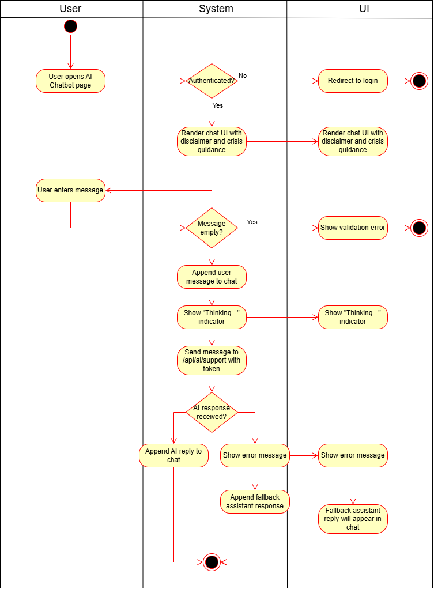
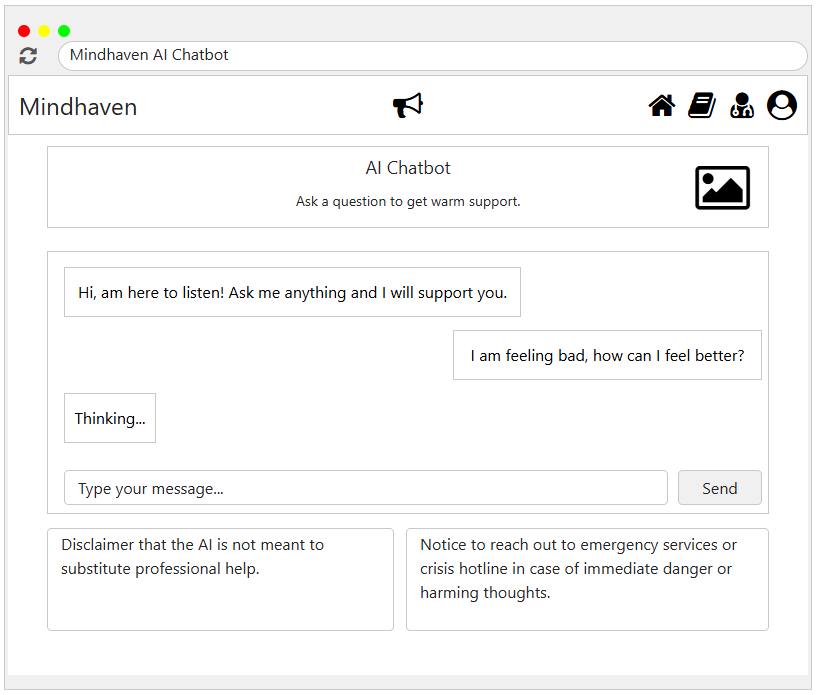

# 1 Use-Case Name

**AI Assistance (Chatbot)**

## 1.1 Brief Description

This use case provides a supportive AI chat experience where users can share how they feel and receive a calm reply with coping tips. The chatbot displays a safety disclaimer and crisis guidance and updates the chat in real time.

---

## 2. Basic Flow

### 2.1 Activity Diagram



### 2.2 Mock-up



- Chat window with message history
- Input field and send button
- Disclaimer and crisis guidance cards

### 2.3 Alternate Flow:

1. **Empty Message**
   - The system shows an error asking the user to enter a message.
2. **User Not Authenticated**
   - The system redirects the user to the login page.
3. **AI Service Unavailable**
   - The system shows an error and posts a fallback assistant message.

### 2.4 Narrative

```gherkin
Feature: AI Assistance Chatbot
  As a user
  I want to chat with a supportive AI
  So that I can receive calm guidance and coping tips

  Scenario: Send a message and receive a reply
    Given the user opens the AI Chatbot page
    And the user is authenticated
    When the user enters a message and presses "Send"
    Then the system posts the message to the chat
    And the UI shows a "Thinking..." indicator
    And the system displays the AI reply
    And the disclaimer and crisis guidance are shown

  Scenario: Attempt to send an empty message
    Given the user is on the AI Chatbot page
    When the user submits an empty message
    Then the system shows a validation error

  Scenario: AI service error
    Given the user submits a message
    When the AI service fails to respond
    Then the system shows an error message
    And a fallback assistant response is displayed
```

## 3. Preconditions:

User must be logged in (valid token)

AI support endpoint must be available

## 4. Postconditions:

The user's message is displayed in the chat

An AI response is displayed in the chat

Disclaimer and crisis guidance are visible

## 5. Exceptions:

Authentication Error: Missing or invalid token

AI Service Error: AI support endpoint fails or times out

UI Rendering Error: Chat messages cannot be displayed

## 6. Link to SRS:

This use case is linked to the relevant section of the [Software Requirements Specification (SRS)](SRS.md).

## 7. CRUD Classification:

### 7.1 Create

The user submits a chat message to the AI service.

### 7.2 Read

The system retrieves and displays the AI response, disclaimer, and crisis guidance.
