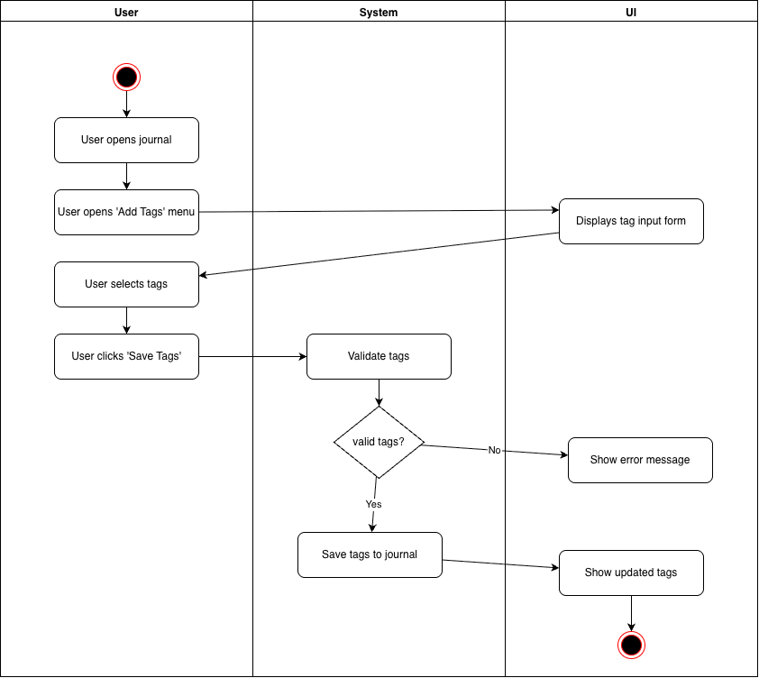
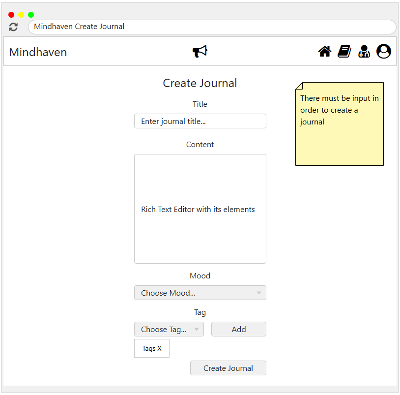

# 1 Use-Case Name
**Add Tags to Journal**

## 1.1 Brief Description
This use case allows a user to attach descriptive tags to a journal entry. Tags help categorize entries by mood, topic, or theme, enabling improved search, filtering, and analytics.

---

## 2. Basic Flow

### 2.1 Activity Diagram


### 2.2 Mock-up

- Journal page with a field/dropdown for selecting or typing tags  
- “Save Tags” button  
- Tag chips displayed below the journal entry

### 2.3 Alternate Flow:
1. **Invalid Tag Format**  
   - If the user enters unsupported tags (too long, invalid characters), the system displays an error.
2. **Tag Limit Exceeded**  
   - If the user exceeds the allowed number of tags, the system prompts an error.
3. **Network/Server Failure**  
   - The system shows a retry message.

### 2.4 Narrative
```gherkin
Feature: Add Tags to Journal
  As a user
  I want to attach descriptive tags to my journal
  So that I can categorize and later search or filter my entries

  Scenario: Successfully adding tags to a journal
    Given the user is viewing a saved journal entry
    When the user opens the "Add Tags" menu
    And the user selects or types one or more tags
    And the user clicks "Save Tags"
    Then the system validates the tags
    And the system stores the tags linked to the journal
    And the UI displays the updated list of tags

  Scenario: Attempt to add invalid tags
    Given the user enters one or more invalid tags
    When the user clicks "Save Tags"
    Then the system rejects the tags
    And the system shows an error message
```

## 3. Preconditions:
User must be logged in

A journal entry must already exist

Tagging functionality must be enabled
## 4. Postconditions:
Tags are saved and associated with the journal

Updated tags appear in the UI
## 5. Exceptions:
System Failure: Database or service failure while saving tags

Validation Failure: Tag input violates system rules

Network Failure: Connection issue prevents saving
## 6. Link to SRS:
This use case is linked to the relevant section of the [Software Requirements Specification (SRS)](SRS.md).

## 7. CRUD Classification:
