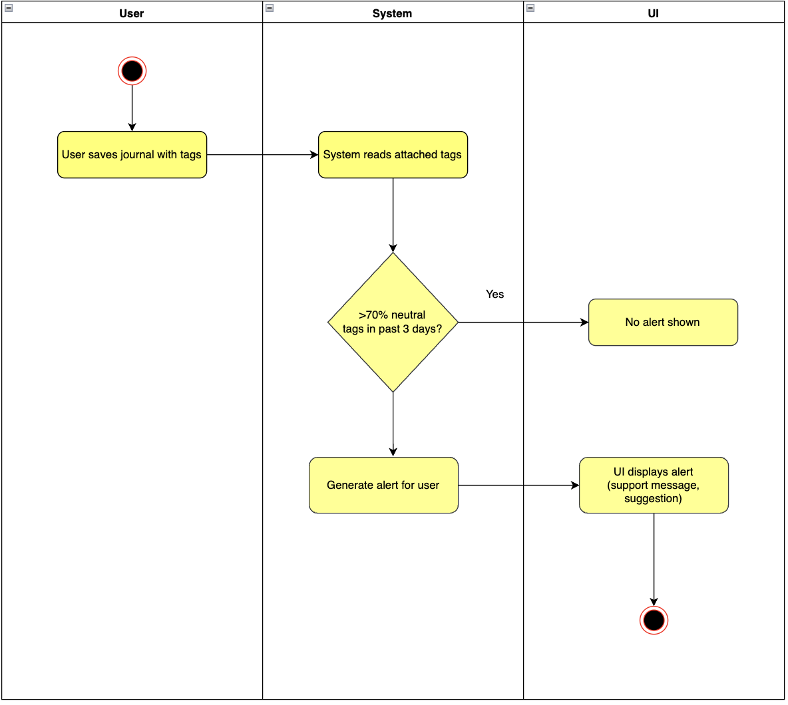

# 1 Use-Case Name
**Alerts**

## 1.1 Brief Description
This use case automatically analyzes the tags attached to a journal entry. If negative emotional tags are detected (e.g., "sad", "angry", "exhausted", "down", "stressed"), the system generates a wellbeing alert to help the user reflect and engage in self-care.

---

## 2. Basic Flow

### 2.1 Activity Diagram


### 2.2 Mock-up
- Alert popup displayed after journal submission  
- Text: "We noticed some difficult emotions in your entry. Would you like some support?"  
- Buttons: **Okay**, **Tips**, **Close**

### 2.3 Alternate Flow:
1. **Tags Are Neutral/Positive**  
   - No alert is shown.
2. **Invalid or Missing Tags**  
   - The system ignores or flags the entry, depending on validation settings.
3. **Alert Already Shown**  
   - The system may skip duplicate alerts for the same entry.

### 2.4 Narrative
```gherkin
Feature: Generate Alerts Based on Tags
  As a user
  I want the system to notify me when I express negative emotions
  So that I can reflect on my wellbeing and take care of my mental health

  Scenario: Alert generated for negative tags
    Given the user saves a journal entry with tags
    When the system analyzes the tags
    And negative mood tags are detected
    Then the system generates an alert
    And the UI displays the alert to the user

  Scenario: No alert for positive or neutral tags
    Given the user saves a journal entry with only positive or neutral tags
    When the system analyzes the tags
    Then no alert is generated

  Scenario: Invalid or unreadable tags
    Given the user saves a journal entry with invalid tags
    When the system attempts to analyze the tags
    Then the system displays an error or ignores tagging
```

## 3. Preconditions:
User must be logged in

A journal entry must already exist

Tagging system must be functioning.

User must save a journal entry with tags.

Tag dictionary must be loaded.

## 4. Postconditions:
System may display a wellbeing alert.

Alert data may be logged for analytics.

## 5. Exceptions:
System Failure: Tag analysis service fails.

Tag Parsing Error: Invalid or missing tags.

UI Rendering Error: Alert cannot be displayed.
## 6. Link to SRS:
This use case is linked to the relevant section of the [Software Requirements Specification (SRS)](SRS.md).

## 7. CRUD Classification:
