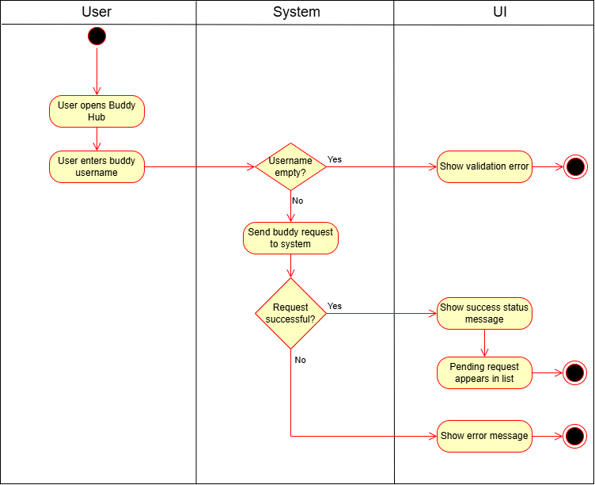
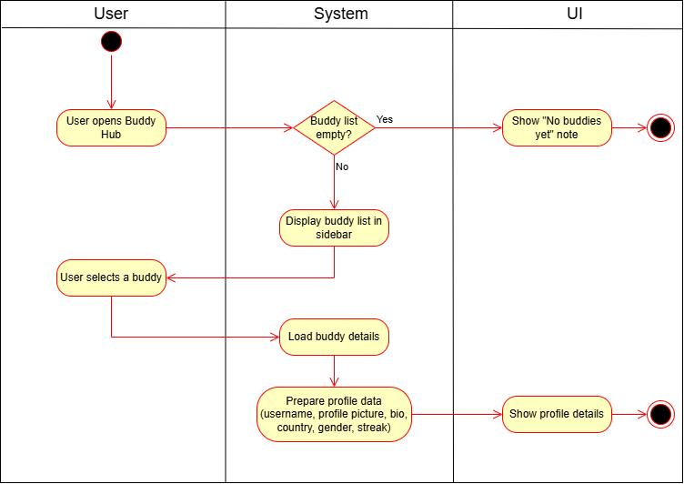
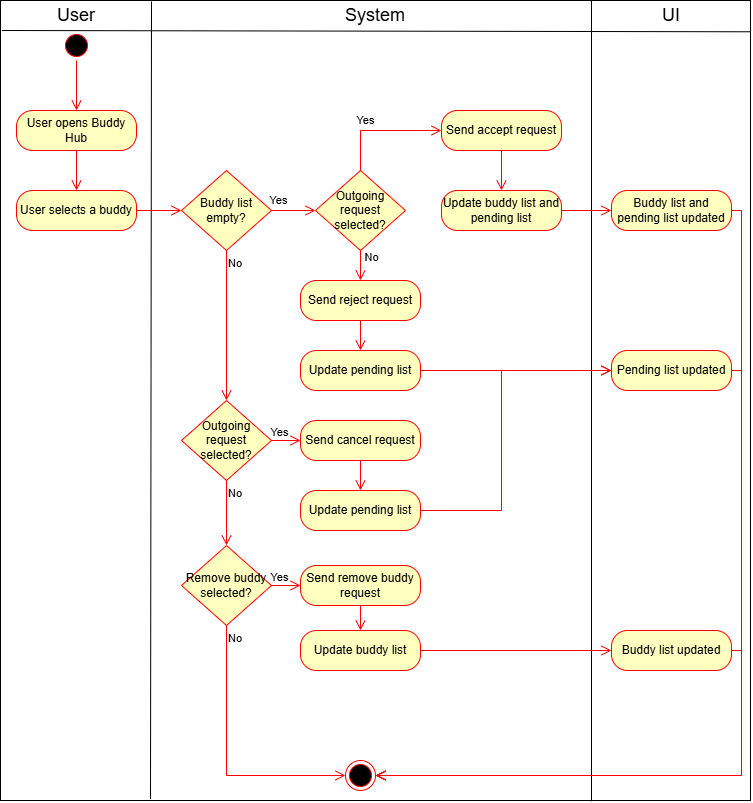
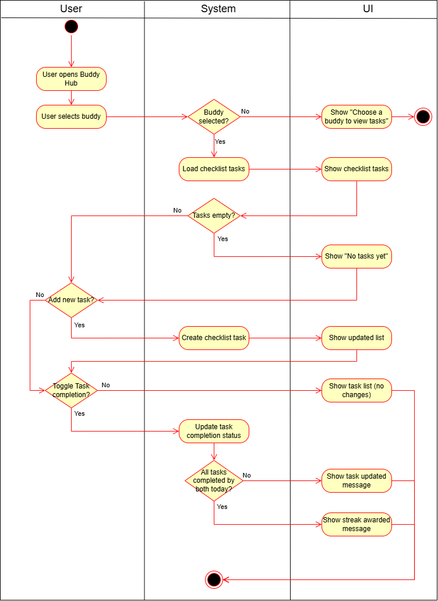
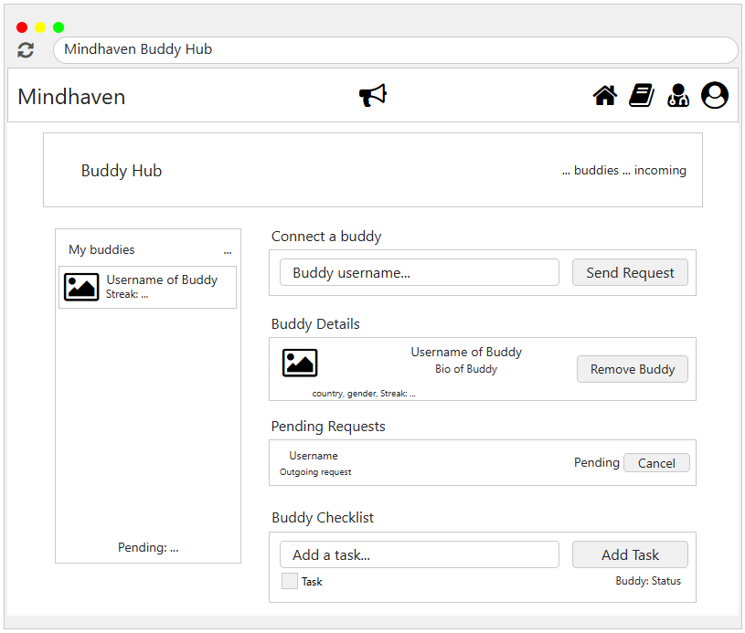

# 1 Use-Case Name

**Buddy**

## 1.1 Brief Description

This use case lets users connect with buddies, manage requests, view buddy profiles, and complete shared checklist tasks that can award wellness streaks.

---

## 2. Basic Flow

### 2.1 Activity Diagrams

#### 2.1.1 Use Case Connect Buddy



#### 2.1.2 Use Case Buddy Profile



#### 2.1.3 Use Case Manage Buddies



#### 2.1.4 Use Case Wellness Streaks



### 2.2 Mock-up



- Buddy Hub with sidebar buddy list and streak counts
- Connect buddy by username
- Pending requests with accept/reject/cancel
- Buddy details and remove action
- Buddy checklist tasks with completion toggles

### 2.3 Subflows (Implemented)

#### 2.3.1 Connect Buddy

- User enters a username and sends a buddy request.
- System stores a pending request and shows a status message.

#### 2.3.2 Buddy Profile

- User selects a buddy from the sidebar.
- System shows profile details (username, bio, country, gender) and current streak.

#### 2.3.3 Manage Buddies

- User accepts or rejects incoming requests.
- User cancels outgoing requests.
- User removes an accepted buddy.

#### 2.3.4 Have Wellness Streaks

- User adds daily checklist tasks for the selected buddy.
- Both buddies can mark tasks as completed.
- When both complete all tasks for the day, a streak is awarded.

### 2.4 Narrative

```gherkin
Feature: Buddy Hub
  As a user
  I want to connect with buddies and complete shared tasks
  So that we can support each other and build streaks

  Scenario: Send a buddy request
    Given the user is on the Buddy Hub
    When the user enters a buddy username
    And the user submits the request
    Then the system creates a pending request
    And the UI shows a success message

  Scenario: Accept an incoming buddy request
    Given the user has an incoming buddy request
    When the user accepts the request
    Then the system marks the request as accepted
    And the buddy appears in the sidebar

  Scenario: Reject an incoming buddy request
    Given the user has an incoming buddy request
    When the user rejects the request
    Then the system removes the pending request
    And the UI shows a status message

  Scenario: Cancel an outgoing buddy request
    Given the user has an outgoing buddy request
    When the user cancels the request
    Then the system removes the pending request
    And the UI shows a status message

  Scenario: View buddy profile details
    Given the user has at least one buddy
    When the user selects a buddy in the sidebar
    Then the system shows the buddy profile details and streak

  Scenario: Remove a buddy connection
    Given the user has a selected buddy
    When the user removes the buddy
    Then the system deletes the buddy connection
    And the buddy is removed from the sidebar

  Scenario: Add a checklist task
    Given the user has a selected buddy
    When the user adds a checklist task
    Then the system creates the task
    And the task appears in the checklist

  Scenario: Complete checklist tasks and earn a streak
    Given the user has a selected buddy
    And there are checklist tasks for today
    When the user completes a task
    And the buddy completes all tasks for today
    Then the system awards a streak
    And the UI shows a streak awarded message

  Scenario: Toggle a checklist task
    Given the user has a selected buddy
    And there is a checklist task for today
    When the user toggles the task completion
    Then the system updates the task status
```

## 3. Preconditions:

User must be logged in (valid token)

Buddy services must be available

## 4. Postconditions:

Buddy requests are created or updated

Buddy list and details are refreshed

Checklist tasks are created or updated

Streaks may be awarded when all tasks are completed by both buddies

## 5. Exceptions:

Validation Error: Missing username or task title

Authentication Error: Missing or invalid token

Service Error: Buddy or checklist endpoint fails

UI Rendering Error: Buddy list or tasks cannot be displayed

## 6. Link to SRS:

This use case is linked to the relevant section of the [Software Requirements Specification (SRS)](SRS.md).

## 7. CRUD Classification:

### 7.1 Create

Send buddy request, create checklist task

### 7.2 Read

Load buddy list, pending requests, buddy profile details, checklist tasks

### 7.3 Update

Accept requests, toggle task completion, award streaks

### 7.4 Delete

Reject or cancel requests, remove buddies
