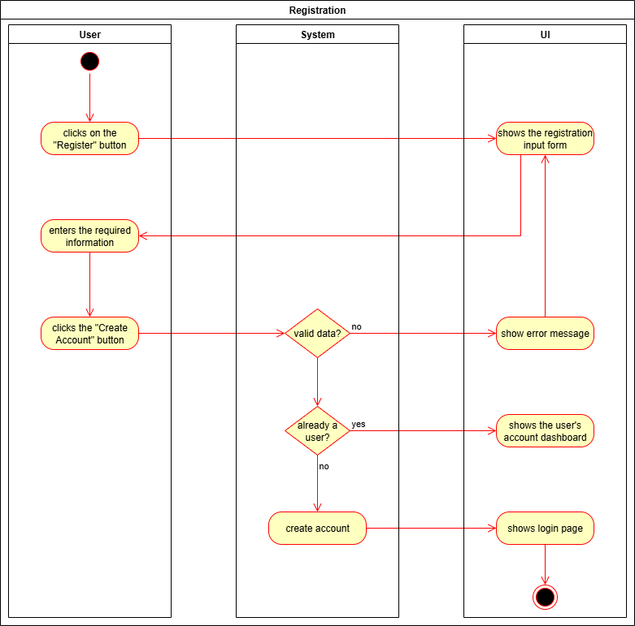

# 1 Use-Case Name
Create Account

## 1.1 Brief Description

## 2. Basic Flow

### 2.1 Activity Diagram


### 2.2 Mock-up

### 2.3 Alternate Flow:

### 2.4 Narrative
```gherkin
Feature: Create Account
    As a new user
    I want to create an account
    So that I can access the web application
  
  Scenario: Open account creation page
    Given I am on the homepage
    When I click the "Register" button
    Then I am redirected to the "Create Account" page

  Scenario: Enter valid data and create an account
    Given I am on the "Create Account" page
    When I enter "myusername" in the "Username" field
    And I enter "myemail@example.com" in the "Email" field
    And I enter "mypassword" in the "Password" field
    And I press the "Create Account" button
    Then I receive a "Success" message
    And I am redirected to the "My Account" page

  Scenario: Enter invalid data and receive error message
    Given I am on the "Create Account" page
    When I enter "myusername" in the "Username" field
    And I enter "invalid-email" in the "Email" field
    And I enter "short" in the "Password" field
    And I press the "Create Account" button
    Then I remain on the "Create Account" page
    And I receive an "Error" message
```

## 3. Preconditions:

## 4. Postconditions:

## 5. Exceptions:
- **System Failure**: 

## 6. Link to SRS:
This use case is linked to the relevant section of the [Software Requirements Specification (SRS)](SRS.md).

## 7. CRUD Classification:
