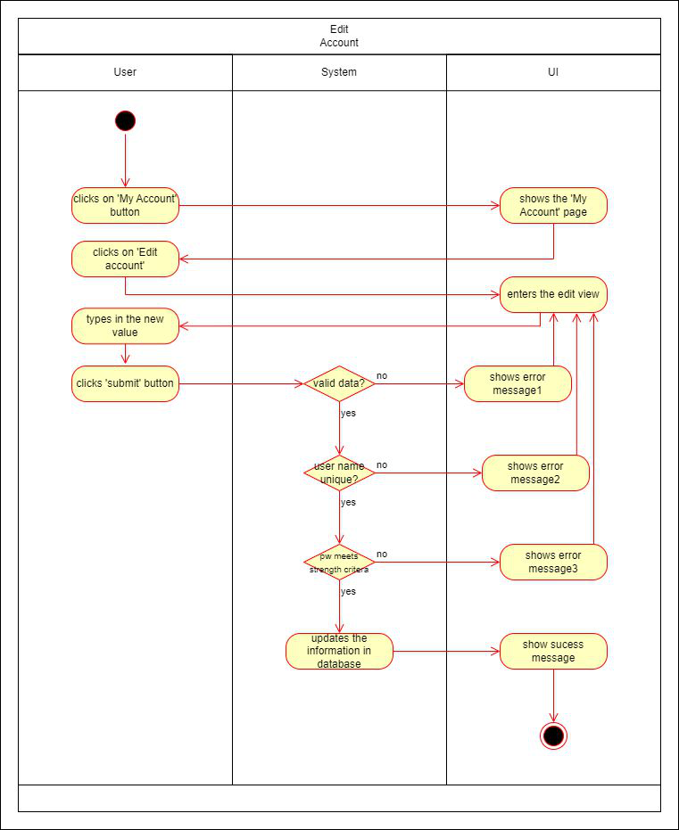
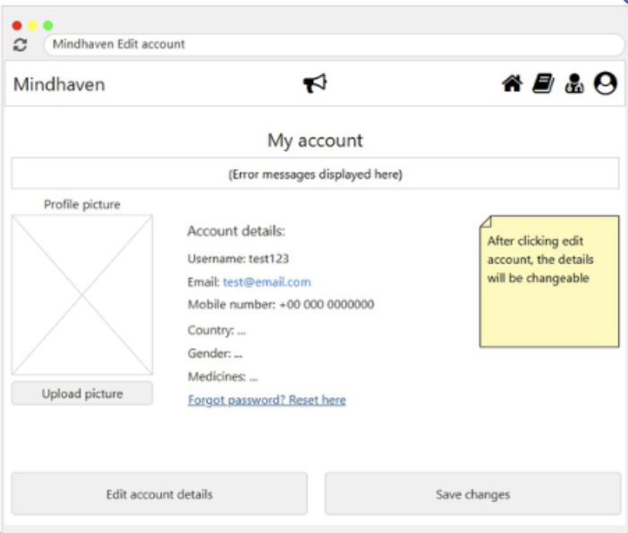

# 1 Use-Case Name
Edit Account

## 1.1 Brief Description

## 2. Basic Flow
1. The user navigates to the account page.
2. The user clicks 'edit account'
3. The user clicks on 'change password' button or 'change username' button
3. The user types in a new value.
4. The system validates the user's input:
   - Ensures the format is valid.
   - Checks that the password meets strength requirements.
   - Ensures that the username is unique and available.
5. If validation is successful, the system updates the user's account information in the database.
6. The system confirms the account edit by showing a success message.

### 2.1 Activity Diagram


### 2.2 Mock-up


### 2.3 Alternate Flow:
- **Invalid Input:**
   - If the user provides an invalid user name or weak password, the system displays an error message and asks the user to correct the form.
- **Duplicate Username:**
   - If the username already exists, the system displays an error message and informs the user, that the username is already taken.

### 2.4 Narrative
```gherkin
Feature: Edit Account
    As a user
    I want to edit my account information
    So that I can change my username or password
  
  Scenario: Open account page
    Given I am logged in
    And I am on the landingpage
    When I click the "Account" button
    Then I am redirected to the "Account" page

  Scenario: Enter valid data and change username
    Given I am on the "Account" page
    When I click on the "Edit Data" button
    And I enter "myusername" in the "Username" field
    And I press the "submit" button
    And the username is not taken already
    Then I receive a "Success" message
    And I am redirected to the "Account" page

Scenario: Enter valid data and change password
    Given I am on the "Account" page
    When I click on the "Edit Data" button
    And I enter "%dh5!XEX" in the "password" field
    And I press the "submit" button
    Then I receive a "Success" message
    And I am redirected to the "Account" page

  Scenario: Enter invalid data and receive error message
    Given I am on the "Account" page
    When I enter "short" in the "Password" field
    And I press the "submit" button
    Then I remain on the "Edit Account" page
    And I receive an "Error" message
```

## 3. Preconditions:

## 4. Postconditions:

## 5. Exceptions:
- **System Failure**

## 6. Link to SRS:
This use case is linked to the relevant section of the [Software Requirements Specification (SRS)](SRS.md).

## 7. CRUD Classification:
