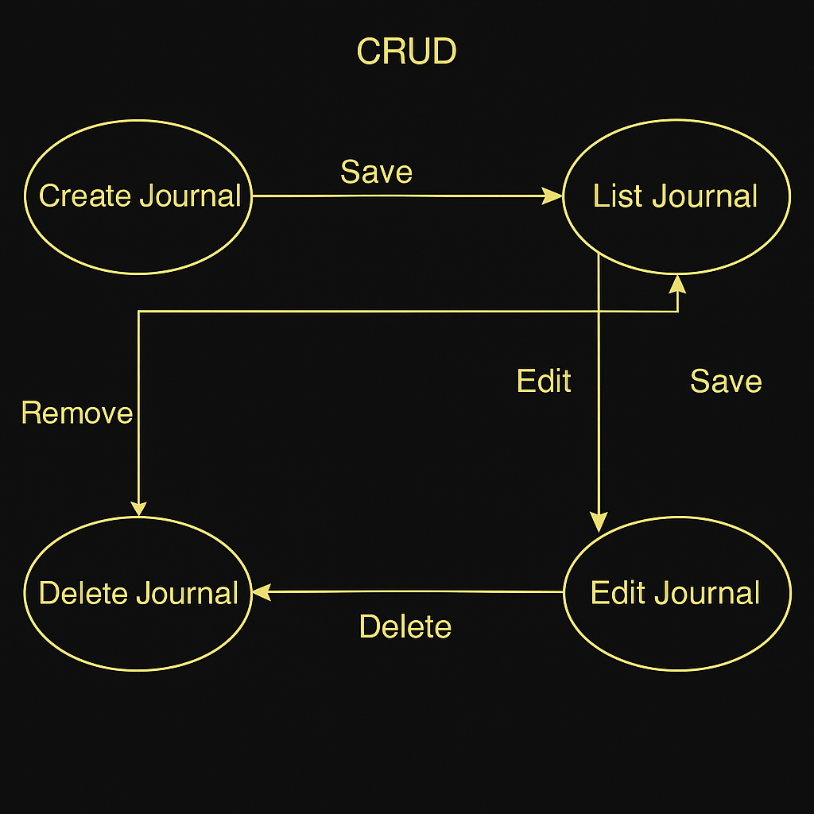
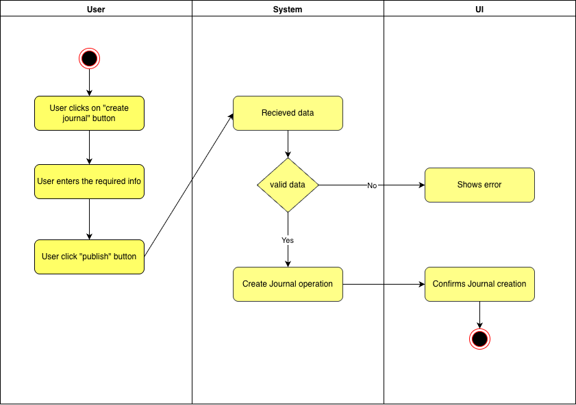
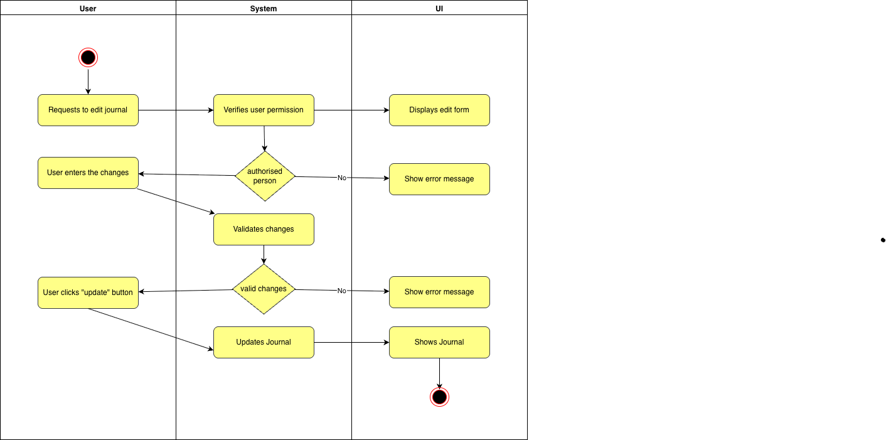
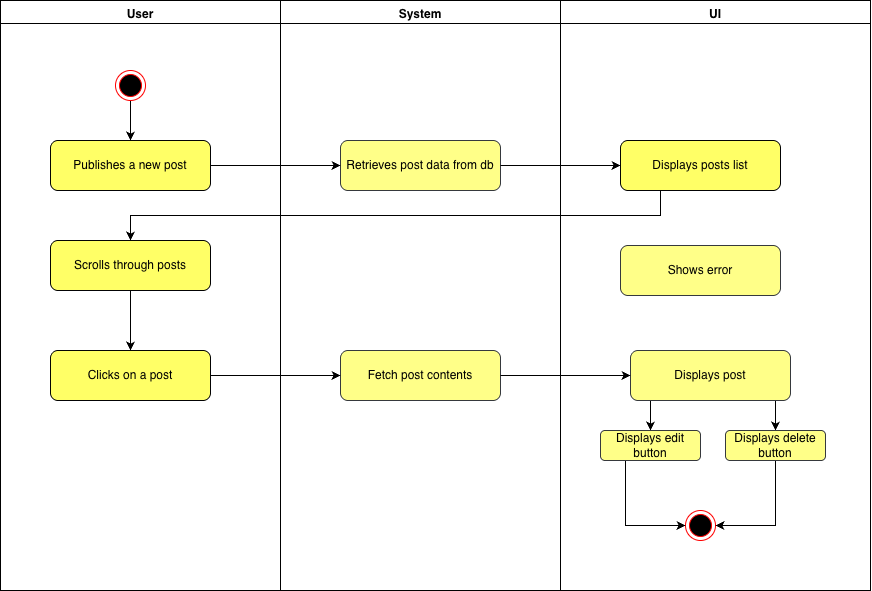
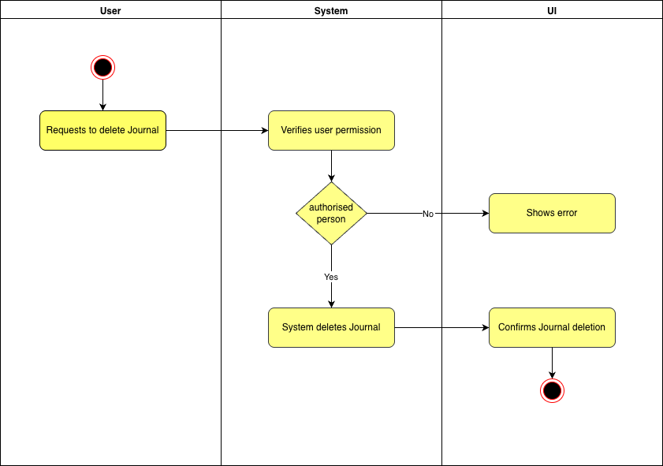

# Use-Case Specification: Manage Journal

## 1. Use-Case: Manage Journal  
### 1.1 Brief Description  
This use case describes the creation, reading, updating, and deleting of journals (CRUD) in the system.

---

## 2. Flow of Events  

### 2.1 Basic Flow  
In general, a user will create a journal, view all journals, edit them as needed, and occasionally delete journals.

### 2.2 Creation 

The creation of a new journal. The user will be asked to enter a title and the content of the journal.

This is what our blog looks like in our application:
 
 

### 2.3 Edit  
During editing, the user can modify the title and the content of the journal.

### 2.4 List  
The user wants to be able to view all of their journals. Therefore, the system presents a list with all entries.

### 2.5 Delete  
The user can delete journals. We added a button in the edit page to delete an entry. To ensure the user does not accidentally delete a journal, we added a modal asking for confirmation.

### 2.6 View Blogjournal
This is a blogjournal view: 
 

---

## 3. Special Requirements

### 3.1 Owning an Account  
In order to create, edit, or delete a journal, the user must have an account. Only if the user is authenticated, the dialog for managing journals will be visible.

---

## 4. Preconditions

### 4.1 The user has to be logged in  
To ensure proper privacy and security, the user must be logged in when managing journals.

---

## 5. journalconditions

### 5.1 Create  
After creating a new journal, the user will be redirected to the list overview, where the new entry will be displayed.

### 5.2 Edit  
After the user saves their edits, the updated journal will be displayed in the list overview.

### 5.3 List  
When the user requests to list all journals, the system will fetch and display all existing journals in a paginated or scrollable format.

### 5.4 Delete  
After confirming the deletion in the pop up window that is shown, the journal will be permanently removed and no longer displayed in the list overview.