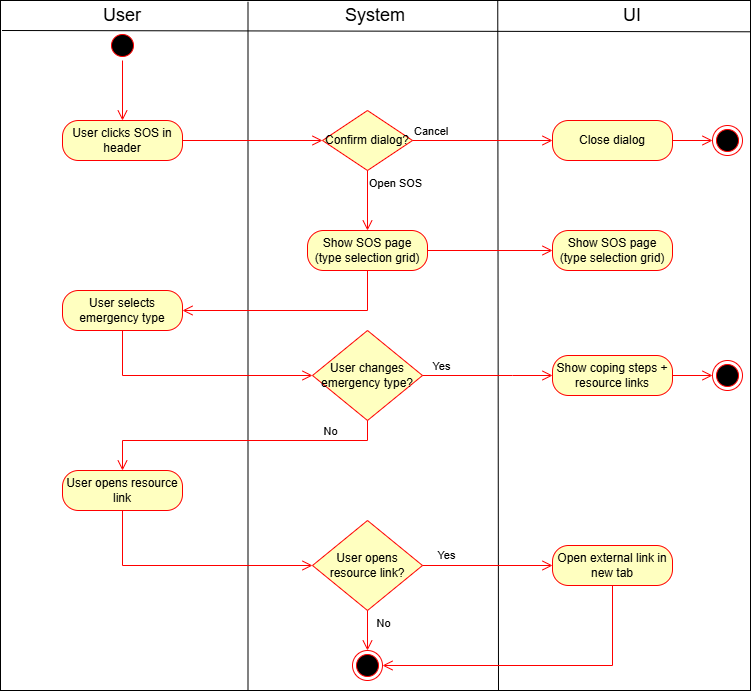
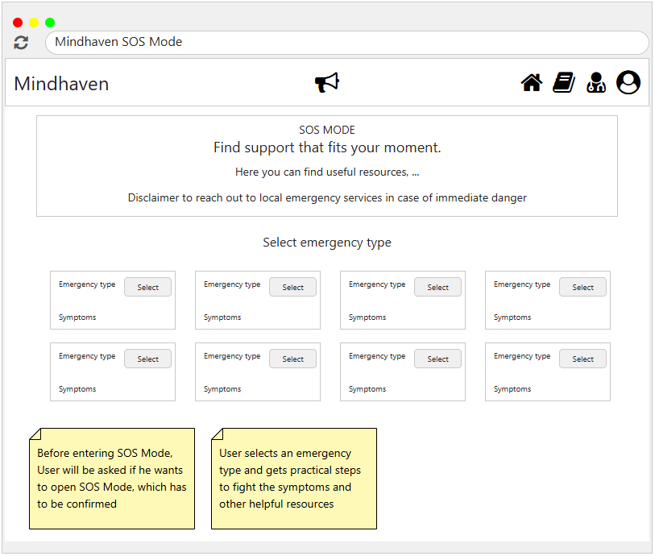

# 1 Use-Case Name

**SOS Mode**

## 1.1 Brief Description

This use case provides a focused support screen where the user selects an emergency type and receives quick coping steps plus external resources (articles, guides, and videos).

---

## 2. Basic Flow

### 2.1 Activity Diagram



### 2.2 Mock-up



- SOS page with selectable emergency categories
- "Try this now" steps tailored to the selected type
- External resource links (articles/guides/videos) opened in a new tab

### 2.3 Alternate Flow:

1. **User Cancels SOS Mode**

- The confirmation dialog is closed and the user stays on the current page.

2. **User Changes Emergency Type**

- The system returns to the emergency type selection grid.

3. **External Link Unavailable**

- The browser shows a standard error page for the external resource.

### 2.4 Narrative

```gherkin
Feature: SOS Mode
  As a user
  I want immediate help options in a crisis
  So that I can access resources and hotline services quickly

  Scenario: Display resources for a selected emergency
    Given the user opens SOS Mode from the app header
    When the user selects an emergency category
    Then the system shows coping steps for that category
    And the UI displays external resources

  Scenario: Change the selected emergency type
    Given the user has selected an emergency category
    When the user clicks "Change type"
    Then the system shows the emergency type selection grid

  Scenario: Open an external resource
    Given the user is viewing SOS resources
    When the user opens a resource link
    Then the resource opens in a new browser tab
```

## 3. Preconditions:

User is in the main app shell (header visible) or navigates to /sos

SOS Mode feature must be enabled

Static SOS resource list must be available in the frontend

## 4. Postconditions:

Relevant steps and resources are displayed to the user

External links can be opened in a new tab

## 5. Exceptions:

External Link Error: A resource URL is unreachable

UI Rendering Error: Resource list cannot be displayed

## 6. Link to SRS:

This use case is linked to the relevant section of the [Software Requirements Specification (SRS)](SRS.md).

## 7. CRUD Classification:

### 7.1 Read

The system displays a predefined list of SOS types, steps, and external resources; no data is created, updated, or deleted.
