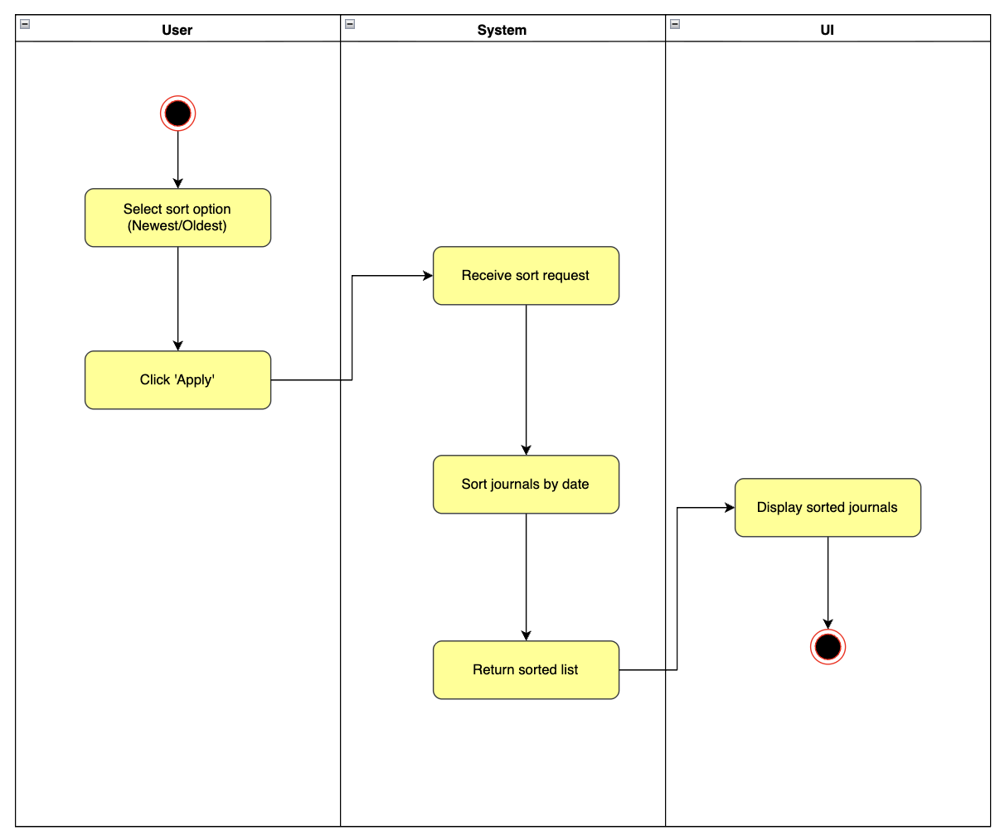

# 1 Use-Case Name
Sort Journals (Newest or Oldest First)

## 1.1 Brief Description
This use case describes how a user sorts their journal entries chronologically.  
The user selects whether journals should be shown from **newest to oldest** or **oldest to newest**, and the system rearranges the displayed list accordingly.

---

## 2. Basic Flow

### 2.1 Activity Diagram


### 2.2 Mock-up


### 2.3 Alternate Flow:

- **AF-1: No Journals Exist**  
  If the user has no journals, the system displays an empty list or a placeholder message.

- **AF-2: Sorting Option Not Changed**  
  If the user selects the same sorting option again and clicks "Apply", the system reloads the journals in the same order.

- **AF-3: System Error**  
  If sorting cannot be applied due to a temporary error, the system shows an error message.

### 2.4 Narrative
```gherkin
Feature: Sort Journals Chronologically
  As a user
  I want to sort my journals by date
  So that I can view them in a meaningful chronological order

  Scenario: Sort journals newest first
    Given I am on the journals page
    And I select "Newest First" in the sort menu
    When I click "Apply"
    Then the system displays journals starting from the most recent

  Scenario: Sort journals oldest first
    Given I am on the journals page
    And I select "Oldest First" in the sort menu
    When I click "Apply"
    Then the system displays journals starting from the oldest entry
```
## 3. Preconditions:

User is logged in.

Journals exist in the database.

## 4. Postconditions:

The journals are displayed in the selected chronological order.

## 5. Exceptions:

System or network error prevents sorting.

Database fails to return sorted results.

## 6. Link to SRS:
This use case is linked to the relevant section of the [Software Requirements Specification (SRS)](SRS.md).
