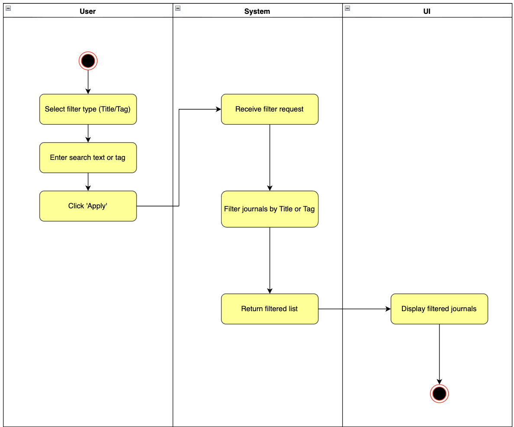
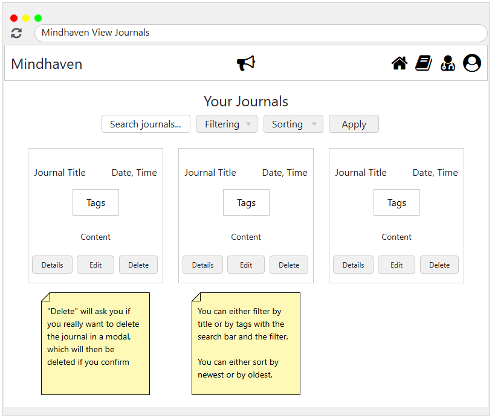

# 1 Use-Case Name
Filter Journals (By Title or Tag)

## 1.1 Brief Description
This use case describes how a user filters their journal entries based on either the journal title or tags. The user selects a filter type, enters a search term, and applies the filter. The system processes the filter request and displays only the journals that match the specified criteria.

---

## 2. Basic Flow

### 2.1 Activity Diagram


### 2.2 Mock-up


### 2.3 Alternate Flow:
- **AF-1: Empty Search Input**  
  If the user clicks “Apply” without entering a search term, the system shows all journals by default.
  
- **AF-2: No Matching Results**  
  If no journals match the title or tag, the system displays an empty list with a “No results found” message.

### 2.4 Narrative
```gherkin
Feature: Filter Journals
  As a user
  I want to filter my journals by title or tag
  So that I can quickly find specific entries

  Scenario: Filter journals by tag
    Given I am on the journals page
    And I choose "Tag" as the filter type
    And I enter a tag in the search bar
    When I click "Apply"
    Then the system shows only journals containing that tag

  Scenario: Filter journals by title
    Given I am on the journals page
    And I choose "Title" as the filter type
    And I enter text in the search bar
    When I click "Apply"
    Then the system shows only journals whose titles contain the search text
```
## 3. Preconditions:

User must be logged in.

User must have at least one journal entry.

## 4. Postconditions:

The screen shows only the journals matching the chosen filter.

## 5. Exceptions:

No journals match the filter criteria.

User enters invalid characters (system handles gracefully).

Backend filter request fails due to network/server error.

## 6. Link to SRS:
This use case is linked to the relevant section of the [Software Requirements Specification (SRS)](SRS.md).
